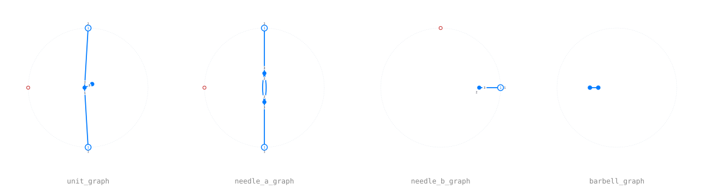

# Diagrams

`src/diagram/`. A [`WordGraph`](@ref) is a planar Soergel diagram: a circular
boundary word, a list of [`Node`](@ref)s, and a list of [`Edge`](@ref)s joining
node ports and boundary leaves. Everything drawn later is built from three
generators.

## Generators and fixtures

```julia
dot(1)
trivalent(1)
braid(1, 2; m = 3)
```

[`diagram/Fixtures.jl`](https://github.com/<user>/DiagrammaticHecke.jl/blob/main/src/diagram/Fixtures.jl)
collects the small named diagrams used throughout the tests and the notebooks:
[`unit_graph`](@ref), [`needle_a_graph`](@ref), [`needle_b_graph`](@ref),
[`barbell_graph`](@ref) and the braid-dot fixtures.



More of them, drawn, in [A gallery](gallery.md).

## Checking a diagram

Three checks, in increasing strictness:

```julia
euler(g) == 2                 # planarity
is_planar_embedding(g)        # the embedding, not just the count
check_wiring(g)               # the wiring convention, as a list of violations
show_wiring_check(g)          # the same, printed with the Euler number
```

Every fixture in the test suite is checked this way. A violation is a
[`WiringViolation`](@ref); [`wiring_table`](@ref) and
[`slot_colour_audit`](@ref) are the debugging views.

## Faces and regions

Two notions that are easy to confuse. [`face_count`](@ref) counts the faces of
the planar embedding. [`region_count`](@ref) counts the **regions**, the
connected pieces of the complement — a strand that cuts a face in two makes two
regions out of one face.

```julia
face_count(g), region_count(g), boundary_regions(g)
inner_faces(g)
display_cell_number(g)         # cell ids drawn into the picture
```

The polynomial labels of the next layer live on regions, not on faces.

## Linear combinations

Rules turn one diagram into a sum of diagrams, so the reduction works on
[`DiagramCombo`](@ref) (over `ℤ`) and `DiagramComboR` (over `R`), keyed by
[`canonical_key`](@ref).

The key is a Weisfeiler–Leman refinement: it identifies two diagrams exactly
when they are the same drawing, so combining terms is a dictionary lookup and
never a graph isomorphism search.

## Decorated diagrams

[`DecoratedDiagram`](@ref) is a `WordGraph` with one [`SoergelPoly`](@ref) per
inner region plus an outer label; [`decorated(g)`](@ref decorated) builds one
with all labels `1`.

## The text format

Every diagram round-trips through a small versioned, line-based text format
that diffs well in git.

```julia
print(wordgraph_to_string(unit_graph()))
g = wordgraph_from_string(s)
```

See [File formats](formats.md) for the whole family and
[`examples/03-word-diagrams.ipynb`](https://github.com/<user>/DiagrammaticHecke.jl/blob/main/examples/03-word-diagrams.ipynb).
