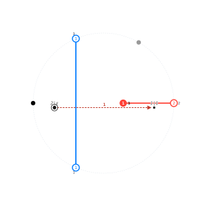
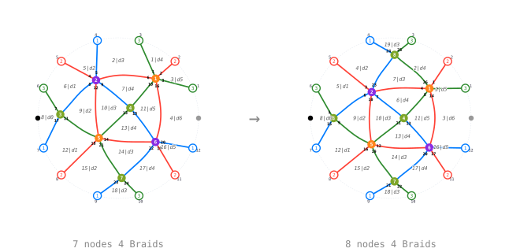
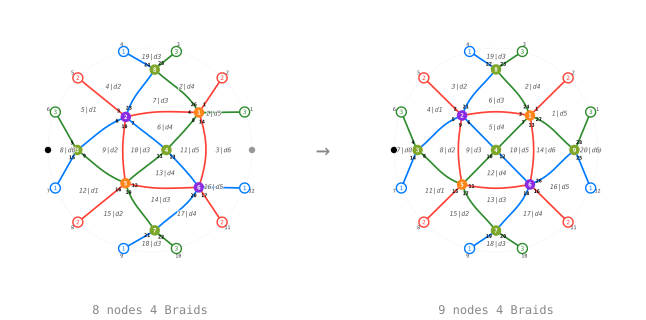
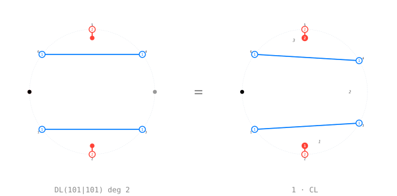
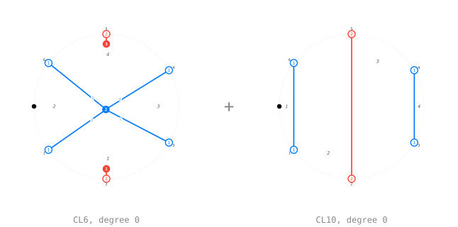

# A gallery

The notebooks in `examples/` are the executable tutorial. This page is a
still-image tour of the same material, for reading without a Julia kernel.

## A light leaf, two ways

`light_leaf([1,2,1], [1,0,1])` as a `MorphismGraph`, and the same diagram as a
`CircularGraph`: the bottom and top boundaries become one circle, cut at the
marking.

## The region word

Every region gets a word: the letters crossed on the way in from the marked
outer region. The arrows are the region tree the walk follows, the labels are
`region|word`. Several rules trigger on this word rather than on node shapes.

## Named diagrams

The fixtures of `diagram/Fixtures.jl`: the unit, the two needles, the barbell.
They are the smallest diagrams on which the dot rules fire.

## Double leaves

The double leaves of `121 -> 121` in degree at most 1. `DL(e|f)` names the pair
of subexpressions the leaf is built from.

## A reduction step

Reduction branches. Most steps replace a diagram by a SUM, so a trace is a tree
and not a line, and the walk below stops at the first branching. Each row is one
step of [`reduce_to_circular_leave`](@ref) on
`DL(100|100)`, labelled with the rule that
fired. [`circular_trace`](@ref) walks the whole thing interactively.

**`circular_rules`**

## Zamolodchikov

The Zamolodchikov axiom: the two sides are the two ways of rewriting the same
reduced expression, and they have to be equal in the category.

The Zamolodchikov stage at work on the right-hand side:

**`parallel_merge`**

**`parallel_merge`**

## From double leaves to circular leaves

The point of the machine. A double leaf of degree 2 over
`121 -> 121` on the left, and on the right what [`cl_reduce`](@ref) turns it
into: 1 circular leaf with a
coefficient in `R`. That is one row of the change-of-basis matrix, drawn.

The circular leaves of degree 0 over `121 -> 121`, 2 of the
12 leaves of the basis:

Every rule of the machine is drawn on its own page,
[Every rule, drawn](rules-gallery.md).
