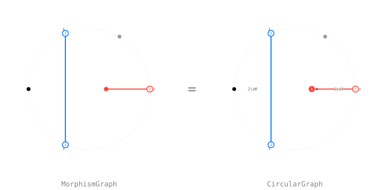

# DiagrammaticHecke.jl

Computer algebra for the **diagrammatic Hecke category** in type A₃: circular
words over `{1,2,3}`, planar Soergel diagrams, the local rewrite rules that
reduce them, and the light-leaves and double-leaves bases, with SVG rendering
of every diagram.

The package answers one kind of question. Given a morphism of Bott–Samelson
bimodules drawn as a planar diagram, what is it in a basis? There are two
bases here, the double leaves and the circular leaves, and the whole machine
exists to move between them.

## Installation

The package is not registered. From a Julia session:

```julia
using Pkg
Pkg.add(url = "https://github.com/<user>/DiagrammaticHecke.jl")
```

Julia 1.11 or newer. The dependencies are `AbstractAlgebra.jl` for the
coefficient ring, [`CoxeterGroups.jl`](https://github.com/ulthiel/CoxeterGroups.jl)
for the Coxeter group of type A₃, and `Cairo.jl` + `Rsvg.jl` to rasterize
diagram SVGs for front-ends that do not render `image/svg+xml`.

## A first computation

```julia
using DiagrammaticHecke

m  = light_leaf([1, 2, 1], [1, 0, 1])   # a light leaf BS(121) -> BS(ε)
fm = circular_morphism(m)               # the same diagram, circular model
display(fm)                             # draws it

labels = fill(one(SoergelPoly), region_count(fm.graph))
combo  = reduce_to_circular_leave(CircularDecoratedMorphism(fm, labels))
show_combo(combo; m = fm)               # the normal form: Σ cᵢ·Dᵢ over R
```

## The layers

The manual follows the layers of the package, and so does the include order in
`src/DiagrammaticHecke.jl`: every file may use what comes above it and nothing
below.

| layer | what it holds | page |
|---|---|---|
| `words/` | circular words, the cyclic rewrite rules, the reduction graph | [Words and rules](words.md) |
| `algebra/` | `R = ℚ[α₁,α₂,α₃]`, the A₃ action, Demazure operators, the pairing | [The Soergel ring](ring.md) |
| `diagram/` | `WordGraph`, faces, regions, canonical keys, linear combinations | [Diagrams](diagrams.md) |
| `morphism/` | `MorphismGraph`, braid moves, light and double leaves | [Morphisms and leaves](morphisms.md) |
| `circular/` | `CircularGraph`, merging, regions, decorations | [Circular diagrams](circular.md) |
| `circular/rules/` | the rules C1–C22, P1, D4, Z1, Z2 and the two drivers | [The rewrite rules](rules.md) |
| `render/` | Tutte layouts, SVG and PNG | [Rendering](rendering.md) |

## Notebooks

`examples/` holds one executable notebook per layer, meant to be read top to
bottom. They are the tutorial half of this manual: every concept below is shown
there with drawn diagrams. Install a kernel bound to the project once,

```julia
julia --project=. -e 'using IJulia;
                      installkernel("DiagrammaticHecke", "--project=" * pwd())'
```

then open `examples/` in Jupyter and pick the **DiagrammaticHecke** kernel. To
run notebook code in a plain script instead, call [`notebook_display_sink!`](@ref)
first: it registers a display that accepts `image/svg+xml`, which
`julia script.jl` lacks.

## Two conventions worth knowing before reading further

**`compose(f, g)` applies `f` first.** As a product of morphisms that is `g∘f`.
Every table keyed by a pair `(f, g)` uses this order.

**Two canonical keys.** `canonical_key` identifies diagrams up to everything;
`circular_canonical_key` keeps the START of the circular word, because the left
marking of a morphism belongs to the diagram. Rotating the boundary word gives
a different key. That is why `DiagramCombo` and `CircularCombo` are separate
types instead of one parametric one.

## Pictures

Every diagram in this manual is drawn by the package itself. `docs/figures.jl`
renders them to `docs/src/assets/figures/` and generates the two picture pages:
[A gallery](gallery.md), a still-image tour of the notebooks, and
[Every rule, drawn](rules-gallery.md), which shows each rewrite rule as an image
equation. Run it before `docs/make.jl` whenever a rule, a fixture or a renderer
changes.



## What is missing

Four things, in the order they are being worked on. The README carries the same
list.

1. **No 13-node.** The author recently found that merging a 1 and a 3 into one
   node is not correct. There is no 13-node mathematically, and building one
   makes the diagram non-planar. Most of what this package computes is
   unaffected and correct as it stands. The rework comes in a future version.
2. **Every Coxeter group.** The package is type A₃ throughout. The goal is to
   take any Coxeter group and build the package for it, with the Coxeter matrix
   as the input the rules read their braid orders off.
3. **The Zamolodchikov relation in H₃.** In A₃ it is an axiom, encoded in Z1 and
   Z2. In H₃ it has to be computed first.
4. **Idempotents and Soergel bimodules.** The bases are here, the idempotents
   that cut out the indecomposables are not.

## Authorship

The mathematics is mine, and it will be presented in an upcoming paper,
*Circular leaves for the diagrammatic Hecke category* (in preparation; the
BibTeX entry `Ro-circular-leaves` is in `CITATION.bib`).

The code is largely written by large language models: Claude for most of it,
Kimi for a smaller part, and GitHub Copilot alongside, all under my direction
and from my specifications. I tested it a lot. The responsibility for what the
package claims is mine.

## License

GNU General Public License, version 3 or later, the same licence OSCAR.jl and
TensorCategories.jl carry. If the package is useful in your work, please cite
it; the BibTeX entry is in the README.
