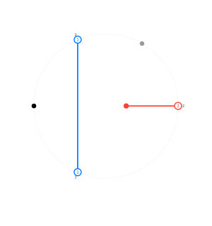
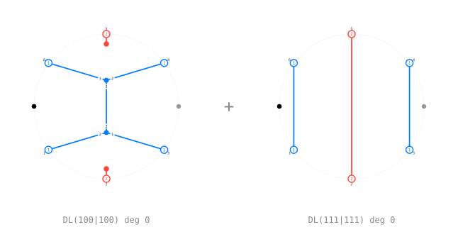

# Morphisms and leaves

`src/morphism/`. A [`MorphismGraph`](@ref) is a `WordGraph` plus two cuts,
which split the boundary word into a **bottom** and a **top**. The diagram is
then read as a morphism `BS(bottom) → BS(top)`.

```julia
m = morphism_graph(g, 1, 3)
bottom(m), top(m)
display(m)
```

A light leaf `BS(121) -> BS(ε)`, which is what `light_leaf([1,2,1], [1,0,1])`
builds:



The double leaves of `121 -> 121` in degree at most 1:



## Argument order

`compose(f, g)` applies **`f` first**. Written as a product of morphisms that
is `g∘f`. Every table in the package keyed by a pair `(f, g)` follows this
order, and the printing in the notebooks says so where it could be misread.

The other constructions on morphisms are [`tensor`](@ref),
[`identity_morphism`](@ref), [`join_graphs`](@ref), the two mirrors
[`hflip`](@ref) and [`vflip`](@ref), and [`shift_left`](@ref) /
[`shift_right`](@ref), which move a single boundary letter between the cuts.

## Braid moves on reduced words

```julia
w0 = [1, 2, 1, 3, 2, 1]
is_reduced(w0)
braid_move_sites(w0)
braid_to_end_with(w0, 3)
words, edges = reex_graph(w0)     # 16 reduced words for the longest element
reduced_words(w)                  # all of them
canonical_word(w)                 # the short-lex representative
```

## Subexpressions

A subexpression `e ∈ {0,1}^k` of a word `x` walks the Bruhat order. Each letter
is either used or skipped, and each step is `U0`, `U1`, `D0` or `D1`.

```julia
for e in subexpressions(3)
    decorations(x, e), expressed_word(x, e), defect(x, e)
end
```

The **defect** is the degree the light leaf built from `e` will have.

## Light and double leaves

[`light_leaf(x, e)`](@ref light_leaf) is the Libedinsky light leaf, a morphism
`BS(x) → BS(expressed_word(x, e))`, built one letter at a time from the
decoration sequence.

```julia
l = light_leaf([1, 2, 1], [1, 0, 1])
display(l)
```

[`double_leaf(x, e, y, f)`](@ref double_leaf) glues a light leaf and a flipped
one along their common target, and [`double_leaves(x, y)`](@ref double_leaves)
enumerates the whole basis of `Hom(BS(x), BS(y))`.

```julia
dls = double_leaves([1, 2, 1], [1, 2, 1])
length(dls) == expected_count([1, 2, 1], [1, 2, 1])   # the pairing agrees
```

That equality is the sanity check of the layer: the number of double leaves per
degree has to be the coefficient of the Bott–Samelson pairing computed in
[The Soergel ring](ring.md).

## Reduction paths

[`PathDiagram`](@ref) is the layer-and-vertex model of a reduction, halfway
between a word rewriting and a drawn diagram. [`graph_to_path`](@ref) peels a
graph outside-in into one; [`path_to_graph`](@ref) and
[`path_from_words`](@ref) wire it back.

See [`examples/04-light-leaves.ipynb`](https://github.com/<user>/DiagrammaticHecke.jl/blob/main/examples/04-light-leaves.ipynb).
