# Every rule, drawn

Each row is one rewrite rule at work: the diagram it matches on the left, the
sum it is replaced by on the right, `0` if the right-hand side is empty. The
captions carry the node count, the number of braid nodes and any region label
that is not `1`. Numbers in the pictures are the debug decorations — arm,
region and leaf numbers.

The examples are not hand-made. Reducing the double leaves of a few word pairs
produces every intermediate diagram, and for each rule the first diagram it
fires on is kept. The rules whose pattern needs a many-armed node or a
particular double connection get a witness built by
`circular/rules/CircularRuleFixtures.jl`; the planar embedding there is
searched, not guessed.

This page is generated by `docs/figures.jl`. The executable version, where the
diagrams can be poked at, is
[`examples/07-all-rules.ipynb`](https://github.com/<user>/DiagrammaticHecke.jl/blob/main/examples/07-all-rules.ipynb).

## The structural rules

`CIRCULAR_RULES`, in registry order — the order in which
[`reduce_circular`](@ref) tries them, which is part of the definition. The
region rules of `CIRCULAR_REGION_RULES` are not drawn separately: they match the
same relations, read off the boundary word of a region instead of off node
shapes, so their pictures would only repeat the ones below.

### `needle`

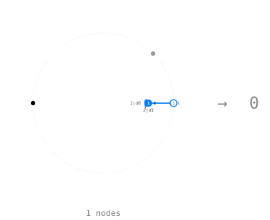

### `pitchfork`

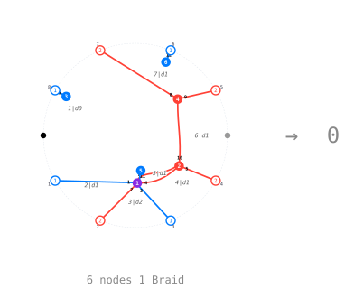

### `dot_walks_on`

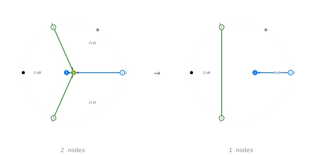

### `barbell`

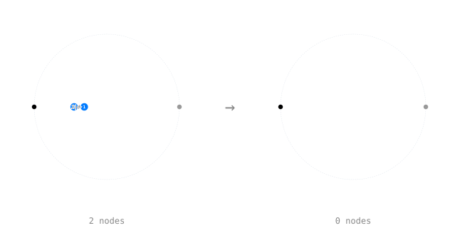

### `bead`

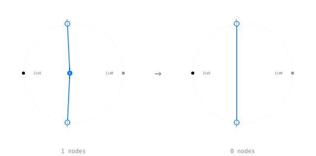

### `mono_double`

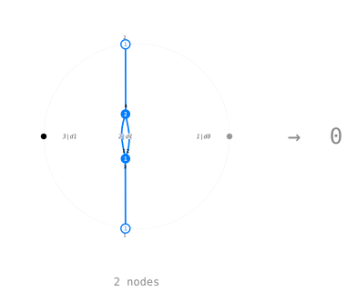

### `two_adjacent_merge`

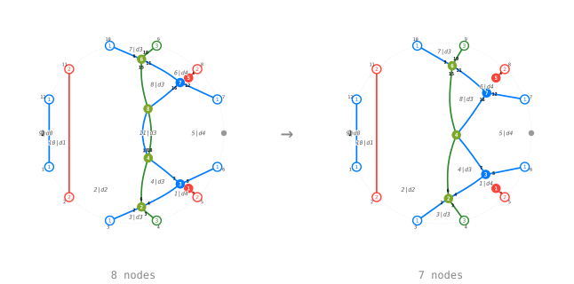

### `commutation_merge`

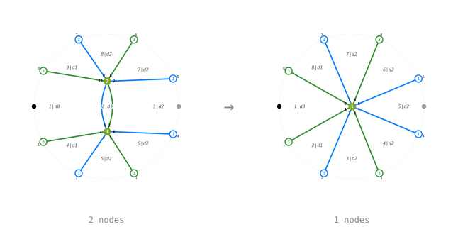

### `merge`

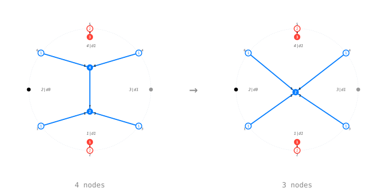

### `dot_into_braid`

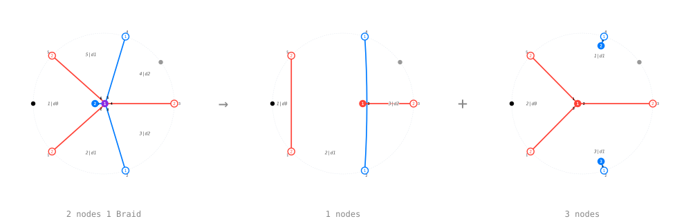

### `braid_back`

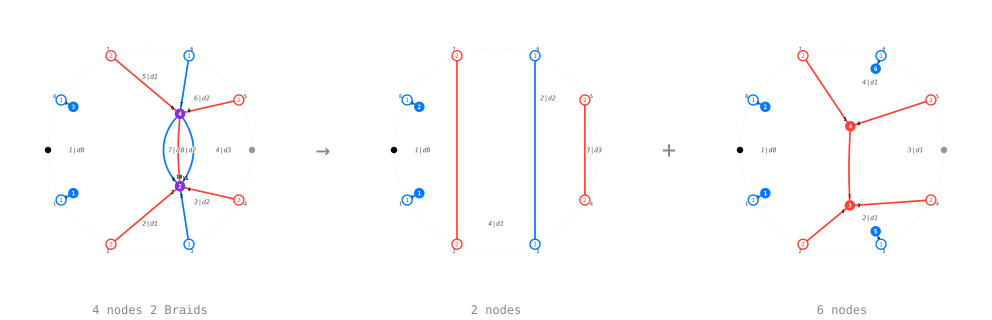

### `braid_relation`

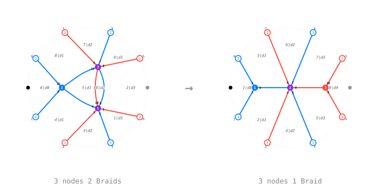

### `two_adjacent_dots`

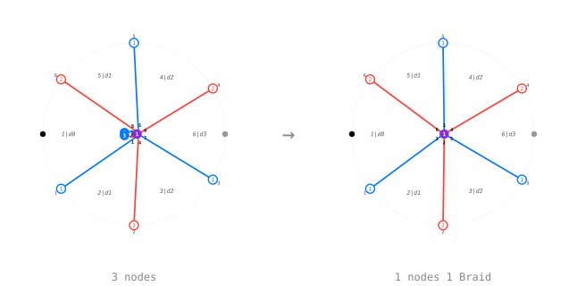

### `dot_on_gen12`

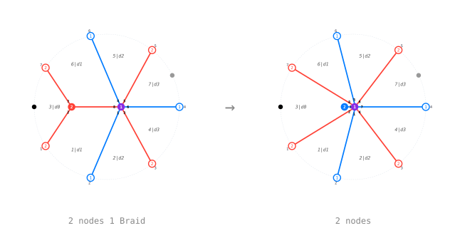

### `braid_on_gen12`

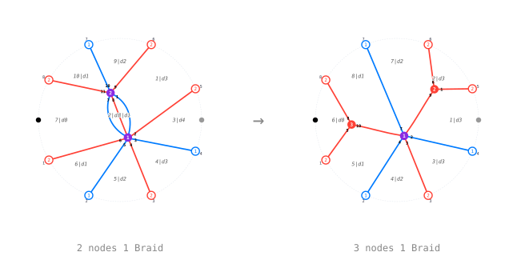

### `gen12_on_gen12`

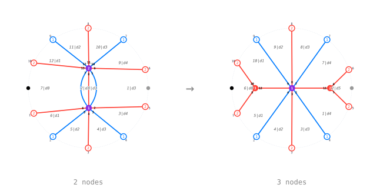

### `gen12_on_gen12_null`

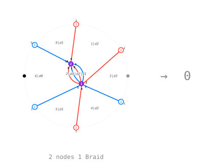

### `gen12_two_edges`

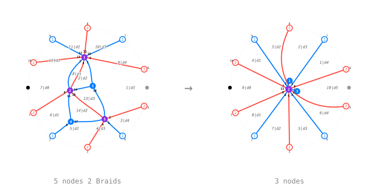

### `gen12_merge`

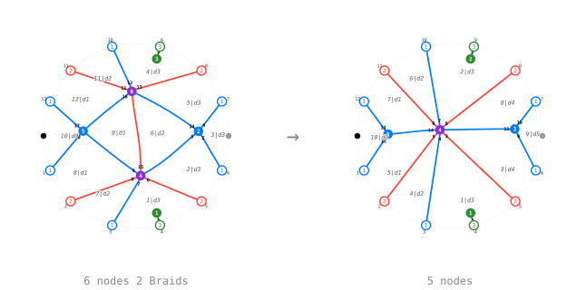

### `trivalent_into_gen12`

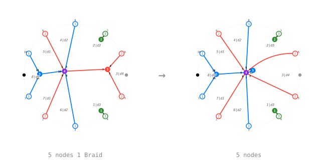

### `mixed_into_gen12`

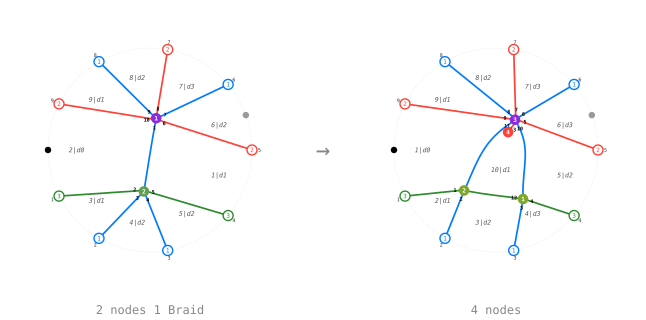

