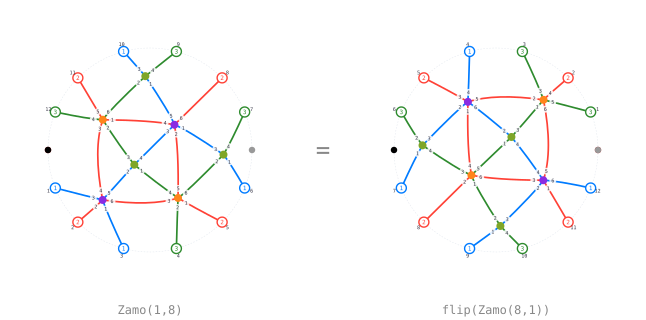

# The Zamolodchikov relation

The Zamolodchikov relation of type A₃ is the one relation of the diagrammatic
category that no local rule implies. In Elias–Williamson it is an axiom. Here
it is available in both roles: as an axiom that the driver may use, and as a
statement the rest of the rules can be tested against.

## The cycle

The longest element of A₃ has 16 reduced words. The 14 essentially different
ones close into a cycle under single braid moves, and [`Zamo(i, j)`](@ref Zamo)
is the morphism built from the braid moves along the cycle from word `i` to
word `j`.

```julia
ws = zamo_words()                    # the 14 words, in cycle order
display(Zamo(1, 3))                  # two braid moves
bottom(Zamo(1, 3)), top(Zamo(1, 3))
```

## The axiom Z1

The two halves of the cycle, `Zamo(1, 8)` and `flip(Zamo(8, 1))`, are two
morphisms with the same bottom and the same top, drawn differently. That they
are equal is the relation.



```julia
A = Zamo(1, 8)
B = flip(Zamo(8, 1))
bottom(A) == bottom(B), top(A) == top(B)
zamo_relation_endpoints_agree()
```

## Deriving Z2

Multiplying both sides of Z1 by `flip(Zamo(1, 2))` below and `Zamo(8, 9)`
above, then reducing both, produces a second relation with `Zamo(2, 9)` on one
side. [`zamo_term_rules`](@ref) returns both as whole-term replacements.

```julia
rules = zamo_term_rules()            # Z1 and Z2
zamo_term_rules(z2 = false)          # Z1 alone
```

## Applying them

[`zamo_pass`](@ref) replaces every term of a sum whose morphism key matches a
rule. Inside [`reduce_to_circular_leave`](@ref) the same replacement runs as
the `:zamo` stage, switchable with [`CIRCULAR_ZAMO_ENABLED`](@ref).

```julia
c1, fired = zamo_pass(c0, lhs.cut1)
circular_trace(fz.graph, fz; steps = circular_steps(:zamo))
```

## The relation as a consequence

With the Zamolodchikov rules **off**, `Zamo(1, 8)` and `flip(Zamo(8, 1))`
reduce to two different circular leaves; with them on, to the same one. The
interesting question is whether the other rules already force that.

Transporting the circular-leaf basis once around the cycle answers it. Each
**stage** glues one braid move below and one above, giving a matrix over `R`
between the leaf bases of consecutive pairs. Three kinds of stage occur:
branchings, where a new leaf appears; losses, where the leaf created one stage
earlier disappears; and plain transports. The product of all fourteen stage
matrices is `diag(1, 1, 0)`.

That is the answer: the columns of `M − I` at the two surviving leaves vanish,
so for the leaves that survive the chain the difference
`Zamo(1,8) − flip(Zamo(8,1))` is a multiple of the leaf that does not survive.
The chain constrains the relation but does not derive it.

[`circular_zamo_region_step`](@ref) and
[`zamo_regions`](@ref) implement the relation as a multi-region pattern rather
than a whole-term match, which is what makes it usable inside larger diagrams;
[`zamo_triangles`](@ref) and the inverse guard handle the backward direction.

See [`examples/09-zamolodchikov.ipynb`](https://github.com/<user>/DiagrammaticHecke.jl/blob/main/examples/09-zamolodchikov.ipynb),
which carries the whole derivation with the matrices printed.
